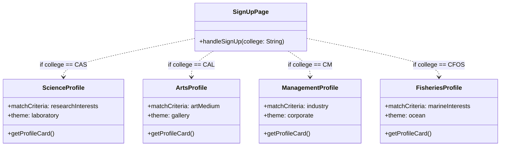
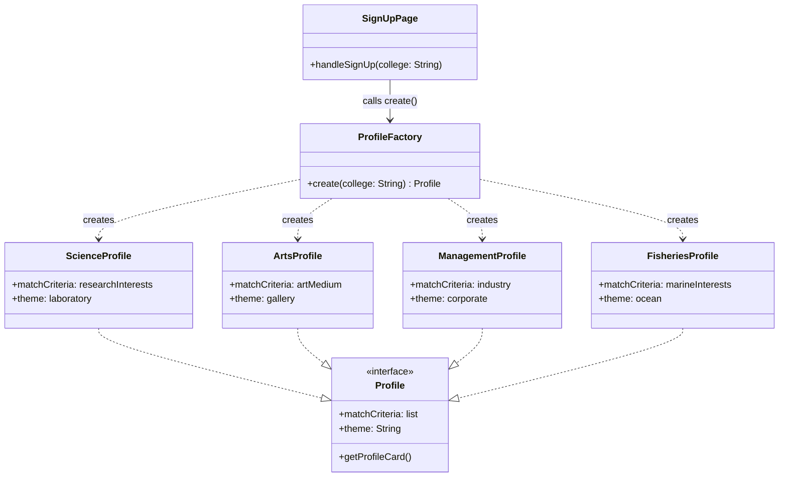

## 🏗️ Design Pattern #1: Creational — Factory Method

### i. Name of Pattern
**Creational – Factory Method**
Applied to: **User Profile Creation**

---

### ii. Concept in Conyo

Okay so imagine may bagong mag-si-sign up sa ating **Course Match** dating app. 
Papipiliin siya ng college niya — CAS, CAL, CM, CFOS, whatever. 
Depende doon, **iba-iba ang profile card niya** — iba ang matching criteria, 
iba ang layout, iba ang mga tanong na sasagutin niya.

'Yung **Factory Pattern** is basically isang "order window" — 
hindi mo na kailangan mag-manually decide kung anong profile ang gagawin. 
Isusugal mo nalang ang college sa factory, tapos siya na bahala.
**"Isa kang CAS student? Here's your ScienceProfile. CAL? ArtsProfile. 
Wala ka sa listahan? DefaultProfile ka muna."**

Ginagamit ito kapag:
- Maraming **types ng isang bagay** ang kailangan gawin
- 'Yung logic kung **anong type** ay depende sa input
- Ayaw mong mag-if-else everywhere sa buong codebase

---

### iii. Visual Diagram

#### ❌ Without Factory Method



#### ✅ With Factory Method



---

### iv. Why it Works Nga

#### ❌ Without Factory — Ang sakit sa ulo nito

So kung walang Factory, 'yung `SignUpPage` mismo ang mag-a-alaala ng lahat ng profile types. 
Ganito magiging laman ng code mo:

```
if college == "CAS":
    profile = new ScienceProfile()
elif college == "CAL":
    profile = new ArtsProfile()
elif college == "CM":
    profile = new ManagementProfile()
elif college == "CFOS":
    profile = new FisheriesProfile()
# ... tapos mag-a-add ka pa ng CAS sub-units, graduate programs, etc.
```

**Problema:**
- Mag-a-add ka ng bagong college? Kailangan mong hanapin at i-edit ang `SignUpPage`, 
  `MatchingPage`, `ProfileEditPage`, `AdminPage` — **lahat ng pages** na may ganyang if-else.
- Miss ka ng isa? **Bug agad.** Hindi mo malalaman kung saan.
- Mahirap i-test ng isolated. Pag na-test mo ang `SignUpPage`, kasama na lahat ng profile logic.
- Sa matagal? **Nightmare to maintain.** Imagine 10 colleges, 5 pages each — 
  that's 50 places to edit every time.

#### ✅ With Factory — Bakit to works nga

May **isang lugar lang** na bahala sa paglikha ng profiles: ang `ProfileFactory`.

- Mag-a-add ng bagong college? **Add one class + one line sa factory. Tapos.**
- `SignUpPage` hindi na nagbabago. Hindi rin `MatchingPage`. Walang nagte-touch ng ibang files.
- Madaling i-test ang factory ng isolated — hiwalay sa UI logic.
- **Open/Closed Principle** — open for extension (bagong college), closed for modification 
  (existing code untouched).

> **TL;DR:** Without factory, ikaw ang factory — at ikaw ang mag-ma-maintain ng lahat ng decision 
> logic sa buong app. With factory, one class lang ang alam ng lahat — at siya na bahala.

---

### v. Pseudocode

```
// ============================================================
// INTERFACE: All profiles must follow this contract
// ============================================================
interface Profile:
    matchCriteria : list of strings
    theme         : string
    getProfileCard() → ProfileCard


// ============================================================
// CONCRETE PROFILE TYPES
// ============================================================
class ScienceProfile implements Profile:
    matchCriteria = ["researchInterests", "labSkills", "favoriteSubject"]
    theme         = "laboratory"

    getProfileCard():
        return ProfileCard(
            banner    = "What's your research interest?",
            accent    = "#1D9E75",   // teal
            criteria  = this.matchCriteria
        )


class ArtsProfile implements Profile:
    matchCriteria = ["artMedium", "favoriteMuseum", "creativeInfluences"]
    theme         = "gallery"

    getProfileCard():
        return ProfileCard(
            banner    = "What's your art medium?",
            accent    = "#D4537E",   // pink
            criteria  = this.matchCriteria
        )


class ManagementProfile implements Profile:
    matchCriteria = ["industry", "careerGoals", "leadershipStyle"]
    theme         = "corporate"

    getProfileCard():
        return ProfileCard(
            banner    = "What industry are you going into?",
            accent    = "#378ADD",   // blue
            criteria  = this.matchCriteria
        )


class FisheriesProfile implements Profile:
    matchCriteria = ["marineInterests", "fieldworkExperience", "favoriteSpecies"]
    theme         = "ocean"

    getProfileCard():
        return ProfileCard(
            banner    = "What's your marine interest?",
            accent    = "#185FA5",   // deep blue
            criteria  = this.matchCriteria
        )


class DefaultProfile implements Profile:
    matchCriteria = ["hobbies", "favoritePlace", "funFact"]
    theme         = "default"

    getProfileCard():
        return ProfileCard(
            banner    = "Tell us something about you!",
            accent    = "#888780",   // gray
            criteria  = this.matchCriteria
        )


// ============================================================
// THE FACTORY — only class responsible for profile creation
// ============================================================
class ProfileFactory:

    create(college: String) → Profile:
        if college == "CAS":
            return new ScienceProfile()
        else if college == "CAL":
            return new ArtsProfile()
        else if college == "CM":
            return new ManagementProfile()
        else if college == "CFOS":
            return new FisheriesProfile()
        else:
            return new DefaultProfile()   // fallback for other colleges


// ============================================================
// USAGE — SignUpPage stays clean, no profile logic here
// ============================================================
class SignUpPage:

    handleSignUp(name: String, college: String, studentNumber: String):
        // Create the right profile — factory decides, not us
        profile = ProfileFactory.create(college)

        // Use the profile — SignUpPage doesn't care what type it is
        card    = profile.getProfileCard()
        displayCard(card)
        saveToDatabase(name, studentNumber, profile)
        navigateTo(MatchingPage)
```
